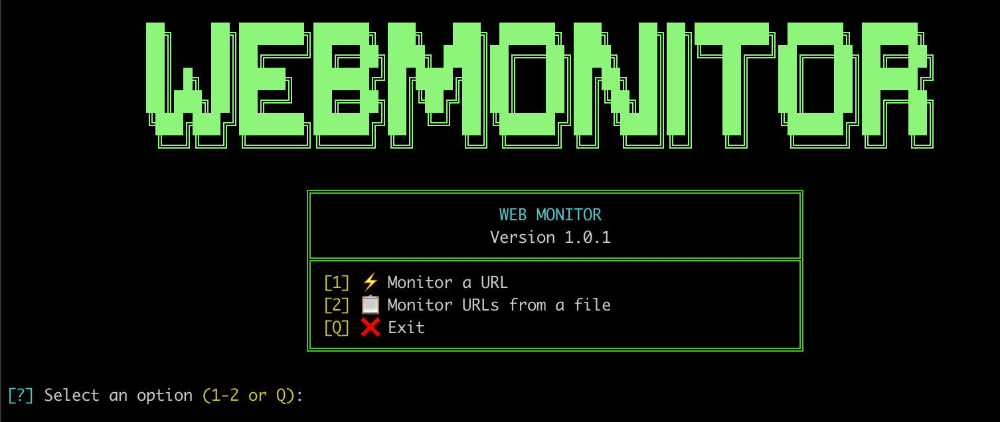

# WebMonitor

Simple terminal-based HTTP/HTTPS availability monitor with an interactive interface and colored messages.




## 📋 Features

- ✅ **Continuous monitoring** of one or more URLs
- ✅ **Automatic normalization** of schemeless URLs (tries HTTPS → HTTP)
- ✅ **DNS pre-check** to avoid unnecessary attempts
- ✅ **Smart detection** of HTTP codes (1xx, 2xx, 3xx, 4xx, 5xx)
- ✅ **Redirect tracking** with full chain (301 → 302 → ...)
- ✅ **Colored messages** for easy status identification
- ✅ **Automatic retries** on timeout or connection error
- ✅ **Specific error handling**: DNS, SSL/TLS, timeout, connection
- ✅ **URL file support** with comments and automatic filtering

## 🚀 Installation

### Requirements

- Python 3.8 or higher
- `pip` (comes bundled with Python)
- `git` (to clone the repository)
- An internet connection (to monitor remote URLs)
- A terminal with ANSI color support (any modern terminal on macOS/Linux)
- Python dependencies: `requests` and `colorama`

### macOS

Check that Python 3 is available:

```bash
python3 --version
```

If it's missing, install it with Homebrew:

```bash
brew install python3
```

On modern macOS, the system Python is "externally managed" and blocks
global `pip install`. Use a virtual environment (recommended):

```bash
cd WebMonitor
python3 -m venv venv
source venv/bin/activate
pip install requests colorama
```

Alternative (not recommended — installs system-wide and can conflict
with Homebrew's own Python packages):

```bash
pip3 install requests colorama --break-system-packages
```

### Linux

Check that Python 3 and `venv` are available:

```bash
python3 --version
python3 -m venv --help
```

If `venv` is missing, install it first (Debian/Ubuntu):

```bash
sudo apt update
sudo apt install python3-venv python3-pip
```

Then create the virtual environment and install dependencies:

```bash
cd WebMonitor
python3 -m venv venv
source venv/bin/activate
pip install requests colorama
```

Alternative for distros without the externally-managed restriction:

```bash
pip3 install requests colorama
```

### Deactivating the virtual environment

Once you're done, leave the virtual environment with:

```bash
deactivate
```

You'll need to run `source venv/bin/activate` again in any new terminal
session before running the script.

## 💻 Usage

### Basic run

If you installed the dependencies in a virtual environment, activate it
first (see [Installation](#-installation)):

```bash
source venv/bin/activate
python3 WebMonitor.py
```

### Menu options

1. **Monitor a URL**: manually enter a URL
2. **Monitor URLs from a file**: reads URLs from `urls.txt` in the same directory

### `urls.txt` file

Copy the provided `urls.example.txt` to `urls.txt` in the same directory
as `WebMonitor.py` (the real `urls.txt` is gitignored so your personal
list isn't committed), then edit it with one URL per line:

```bash
cp urls.example.txt urls.txt
```

```text
# Comments are ignored automatically
https://example.com
http://test-site.com
google.com
# You can also specify ports
example.com:8080
https://example.com:8443
```

**File features:**
- Empty lines are ignored automatically
- Comments starting with `#` are ignored
- Supports URLs with or without a scheme (`http://`, `https://`)
- Supports custom ports (`host:port`)

## 📊 HTTP Status Codes

The monitor classifies and displays all standard HTTP codes:

| Code | Meaning | Color | Example |
|------|---------|-------|---------|
| **1xx** | Informational | 🔵 Blue | `ℹ️ Site up with informational HTTP response 100`
| **2xx** | Success | 🟢 Green | `[+] https://example.com is online (Status: 200)`
| **3xx** | Redirect | 🔵 Blue | `🔁 Site up with HTTP redirect 301 -> 302`
| **4xx** | Client error | 🟠 Orange | `⚠️ Site up with client HTTP response 404`
| **5xx** | Server error | 🟠 Orange | `⚠️ Site up with server HTTP error 500`

### Redirects

When it detects redirects, it shows:
- The full redirect code chain (e.g. "301 -> 302 -> 307")
- The final URL after all redirects
- The final HTTP code of the destination (if it's 4xx, 5xx, or a final 3xx)
- If the final destination is 2xx, no extra message is shown (avoids duplication with the redirect chain)
- If the final destination is also 3xx, it indicates that it won't be checked further to avoid infinite loops

**Examples:**

Redirect ending in success (2xx):
```
🔁 Site up with HTTP redirect 301 -> 307: http://example.com → https://www.example.com/en
```
*Note: When redirects end in 2xx, only the redirect chain is shown. The "OK 200" message is suppressed to avoid duplication.*

Redirect ending in an error (4xx/5xx):
```
🔁 Site up with HTTP redirect 301: http://bad-site.com → http://bad-site.com/error
⚠️ Site up with client HTTP response 404: http://bad-site.com/error
```

Redirect ending in another redirect (3xx):
```
🔁 Site up with HTTP redirect 301 -> 302: http://example.com → https://example.com
🔁 Site up with HTTP redirect 307: https://example.com (will not be checked further to avoid infinite loops)
```

## 🎨 Messages and Colors

| Type | Color | Icon | Example |
|------|-------|------|---------|
| **Success (2xx)** | 🟢 Green | `[+]` | `[+] https://example.com is online (Status: 200)` |
| **Informational (1xx)** | 🔵 Blue | `ℹ️` | `ℹ️ Site up with informational HTTP response 100` |
| **Redirect (3xx)** | 🔵 Blue | `🔁` | `🔁 Site up with HTTP redirect 301` |
| **Client error (4xx)** | 🟠 Orange | `⚠️` | `⚠️ Site up with client HTTP response 404` |
| **Server error (5xx)** | 🟠 Orange | `⚠️` | `⚠️ Site up with server HTTP error 500` |
| **DNS error** | 🔴 Red | `🌐` | `🌐 DNS error at example.com: domain does not resolve` |
| **SSL/TLS error** | 🔴 Red | `🔒` | `🔒 SSL error at example.com: certificate issue` |
| **Timeout** | 🔴 Red | `⏳` | `⏳ Timeout at example.com: web service is not responding` |
| **Service unavailable** | 🔵 Blue | `🚫` | `🚫 Web service unavailable: example.com` |
| **Retry** | 🟡 Yellow | `↻` | `↻ Connection issue, retrying attempt 1/2...` |
| **Too many redirects** | 🔵 Blue | `🔁` | `🔁 Too many redirects: example.com` |

## ⚙️ Technical Configuration

### Timeouts

- **Normalization (HEAD)**: 1.0 second per protocol (HTTPS first, then HTTP)
- **Main request (GET)**: 2.0 seconds
- **Retries**: 2 attempts before reporting a definitive failure
- **Total time for unavailable sites**: ~4 seconds (2s per attempt: 1.0s HTTPS + 1.0s HTTP)

### Monitoring Process

1. **DNS pre-check**: checks whether the domain resolves before attempting an HTTP connection
2. **Normalization**: if the URL has no scheme, tries HTTPS first (HEAD, 1.0s), then HTTP (HEAD, 1.0s)
3. **Main request**: performs a GET with automatic redirect following (2.0s timeout)
4. **Redirect detection**: if `response.history` is present, shows the full 3xx code chain
5. **Classification**: analyzes the final HTTP code and shows the appropriate message (suppresses "OK 200" if a redirect was already shown)
6. **Retries**: on timeout or connection error, retries automatically (2 attempts max)

### Error Handling

The monitor distinguishes between several error types:

- **DNS**: domain doesn't exist or doesn't resolve
- **SSL/TLS**: protocol or certificate issues
- **Timeout**: the site doesn't respond in the expected time
- **Connection refused**: closed port or service not set up
- **No route**: network or routing issue
- **Service unavailable**: DNS resolves but there's no HTTP/HTTPS service
- **Too many redirects**: redirect loop detected by requests (no retry, reported immediately)

## 🛠️ Development

### Code Structure

- **Centralized messages**: all messages live in the `MESSAGES` dictionary
- **Helper functions**: `extract_host()`, `check_dns()` to avoid code duplication
- **Exception handling**: specific per type (`TooManyRedirects`, `Timeout`, `ConnectionError`, etc.)
- **RGB colors**: customized for better readability
- **Optimizations**: simplified `response.history` check, suppression of duplicate messages

### Interruption

Press `CTRL+C` at any time to stop monitoring and return to the main menu.

### Design History

Notes on implementation decisions made while building the current
message/retry logic, kept here for context:

- Messaging was centralized into the `MESSAGES` dictionary with
  unified text for every case (OK, 1xx, 3xx, 4xx, 5xx, DNS, SSL,
  timeout, service unavailable) instead of scattering strings across
  the code.
- `normalize_url` resolves DNS first (`socket.gethostbyname`); if it
  doesn't resolve, it returns `None` and the DNS error is reported in
  the main flow. It then uses a quick `HEAD` probe to detect the
  scheme, trying HTTPS first and falling back to HTTP.
- The main check uses `GET` with a 2.0s timeout; retries apply to
  timeouts, connection errors, and cases where no web service is
  detected, with consistent retry messages.
- **Reverted**: a 0.3s backoff between retries was tried and dropped.
- **Reverted**: an earlier version normalized URLs without `requests`
  and alternated the scheme on each attempt instead of resolving it
  once — replaced by the current single-resolution approach.

## 📝 Notes

- The monitor automatically follows HTTP redirects using `allow_redirects=True`
- If a redirect chain ends in 2xx, only the chain is shown (no extra "OK 200")
- If a redirect ends in another redirect (3xx), it indicates it won't be checked further to avoid infinite loops
- If there are too many redirects (requests' limit), it is reported immediately without retries
- Messages show the final URL after all redirects when applicable
- The `urls.txt` file must be in the same directory as the script
- The code optimizes the `response.history` check for better performance

## 🗺️ Roadmap

Future improvements under consideration:

- Treat 1xx/3xx as success (`True`) if that behavior is preferred.
- Make timeouts and retry count configurable (config file or env vars).
- Add file/JSON logging with rotation.
- Add concurrency for monitoring large URL lists.

## 🤝 Contributing

Contributions are welcome. Please open an issue or pull request.

## 📄 License

This project is licensed under the GNU General Public License v3.0 - see [LICENSE](LICENSE) for details.

## 👤 Author

[jensyleo](https://github.com/jensyleo) - developed as part of the EH (Host Exploration) project.

---

**Version**: 1.0.2
